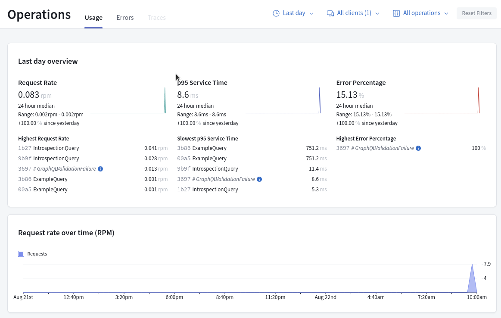

# firebase-firestore-graphql

ToDo app [GraphQL](https://graphql.org/) setup with a Firebase Firestore backend and [Auth0](https://auth0.com/) for authentication. Uses [Apollo Engine](https://www.apollographql.com/) and deployed to Cloud functions.
#### You can play with this [Apollo demo](https://us-central1-todoapp-e0ae5.cloudfunctions.net/to-do-app)
#### I Built this [small front](https://todoapp-e0ae5.web.app/) to authenticate users with auth0 and find the token
#### Also added [postman documentation](https://documenter.getpostman.com/view/19719511/VUqpvJkR) for easy testing
## Initial setup

Personally, I use Makefile for the tab completion, bash scripting and the power of making user friendly and readable commands

### Using node 
#### Installing dependencies
```bash
make install
```
#### Running the app
```bash
make run
```

### Using docker
This command will do everything for you:
* Creating the container
* Installing dependencies
* Start the application
* Expose the application to localhost port

```bash
make start-docker
```

## Firebase setup

Download Firebase service account as `service-account.json` and put in root of this directory.
In your firestore database setup two collections, one of tweets and one of users. The userId in tweets should point to a user Id that the tweet came from.

*Just for a few days, I'll be publishing the service-account.json. Soon will be deleted :) 
```typescript
interface Status {
    id: string;
    description: string;
}

interface Task {
    id: string;
    name: string;
    description: string;
    status: string;
    created_date: string;
    updated_date: string;
}

export interface User {
    id: string;
    name: string;
    email: string;
    created_date: string;
    updated_date: string;
}
```


If you navigate to the URL you should be able to see a GraphQL playground where you can query your API, congrats!

## Apollo Operations

All the request are logged through Apollo, you can use this information by changing `APOLLO_KEY` and `APOLLO_GRAPH_REF`. 



## Troubleshooting

### Had a problem with the dependencies using node?
```bash
make uninstall
make install
```

### Had a problem with docker?
This is a dangerous command, it will delete all the images and containers, but it is always helpful 
```bash
make clean-all-docker
```

### Had a problem with the authentication?
There is a rate limit with Auth0 and Apollo sends a ton of request for introspection, the fix is changing the value in src/configServer.ts
```bash
introspection: false
```